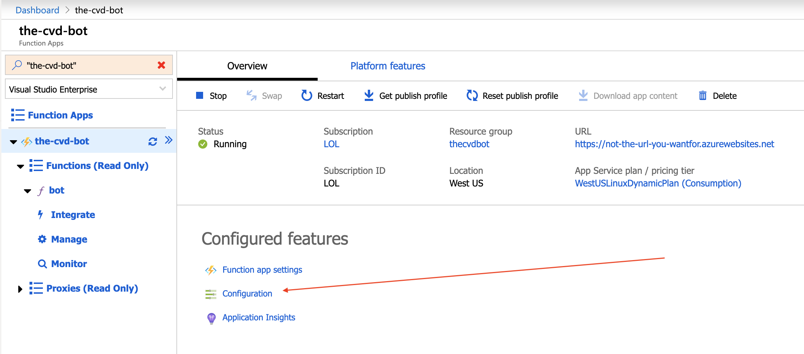
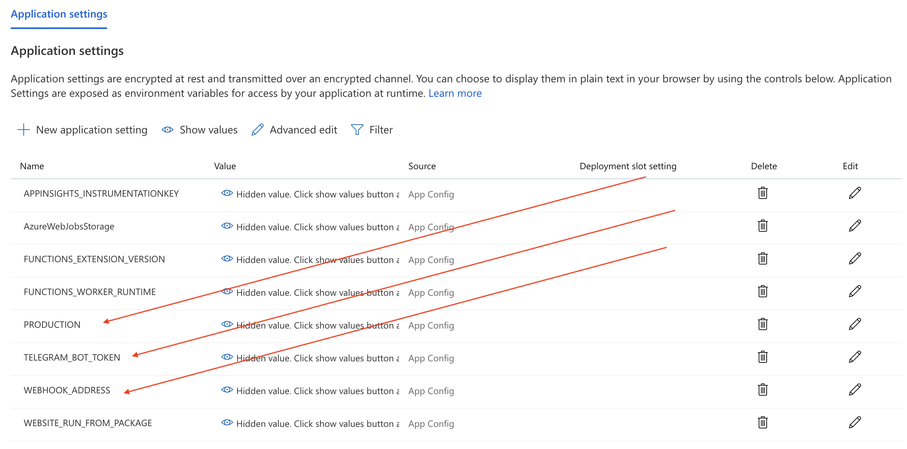

<p align="center">
  
</p>

# The CVD Bot

A free, open source Telegram Bot for keeping up to date on the Coronavirus with the latest news and statistics.

You can get use the bot here: [The CVD Bot](https://t.me/thecvdbot)

You can also choose to run it yourself or you can contribute to this project.

## Requirements

- [Microsoft Azure](https://portal.azure.com) Account
- [Telegram](https://telegram.org) Account
- [VS Code](https://code.visualstudio.com/) for Production Deployment and Local Development
- [Azure Functions](https://marketplace.visualstudio.com/items?itemName=ms-azuretools.vscode-azurefunctions) VS Code Extension for Local Development
- [ngrok](https://ngrok.com/download) for Local Development
- [Node.js LTS Version](https://nodejs.org/en/about/releases/)

## Hacking

- Setup your own bot on Telegram with [The Botfather](https://t.me/BotFather).
- Grab your API Key from The Botfather.
- Clone this repo and install dependencies.

```sh
git clone https://github.com/joemccann/the-cvd-bot.git
cd the-cvd-bot
npm i
```

- Create a `local.settings.json` file in the root of the repo and copy/paste the following:

```sh
{
  "IsEncrypted": false,
  "Values": {
    "AzureWebJobsStorage": "",
    "FUNCTIONS_WORKER_RUNTIME": "node",
    "TELEGRAM_BOT_TOKEN": "YOUR-BOT-TOKEN",
    "WEBHOOK_ADDRESS_LOCAL": "https://YOUR-NGROK-SUBDOMAIN.ngrok.io/api/bot",
    "WEBHOOK_ADDRESS": "https://YOUR-AZURE-FUNCTION-NAME.azurewebsites.net/api/bot"
  }
}
```

- In a terminal, launch `ngrok` with the following command to set up a local proxy:

```sh
ngrok http 7071 -host-header=the-cvd-bot
```

- Now copy/paste the `ngrok` URL into your `local.settings.json` file and append `/api/bot` to the URL.  This serves as a proxy to your webhook when developing locally.

## Deployment

For a production deployment, this repo targets Azure. You'll need an [Azure](portal.azure.com) account that has its payment active as you'll need to publish this Azure Function to obtain your production Webhook API (i.e. your-unique-name.azurewebsites.net).

Upon a successful first deployment, you'll need to add some production environment variables.

In the Azure portal, navigate to the application settings within the Azure Function Configuration page for your CVD Bot Azure Function:

<p align="center">
  
</p>

You'll need to add (+) a new application setting for each of the following names and their values:

```sh
PRODUCITON: true
TELEGRAM_BOT_TOKEN: YOUR-TELEGRAM-BOT-TOKEN
WEBHOOK_ADDRESS: YOUR-AZURE-WEBSITES-PRODUCTION-URL
```

<p align="center">
  
</p>

Save these setting and confirm a restart of your Azure Function.

Navigate to your bot and test out the commands.

## Tests

```sh
npm i -D
npm test
```

## Sources

- Stats provided by https://corona.lmao.ninja/all
- News articles scraped from https://jerrybrito.com/coronafeed/

## Contributing

The general guidelines for contributing are:

- Does it fix a bug?
- Does it break anything?
- Does it stick to the original goal of The CVD Bot (an informational Telegram bot to keep up withg the CVD-19 virus)
- Does it reduce the build size?
- Is it necessary?

## Contributors

- [@joemccann](https://twitter.com/joemccann)

## License

MIT
